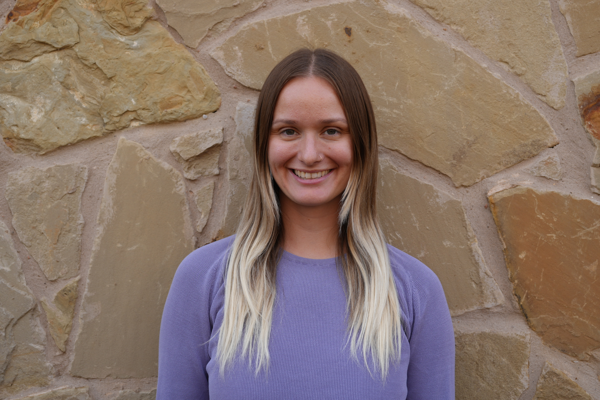

::: column-margin
{style="width: 200%; max-width: none;"}
:::

## Welcome to my personal website!

My name is Rebecca (Becca) Luttinen. I am a PhD candidate in Applied Demography at the [University of Texas at San Antonio.](https://hcap.utsa.edu/sociology-and-demography/) I also work as a researcher at the [Institute of Social Research and Data Innovation](https://isrdi.umn.edu/).

## Biography

I grew up in Metro Detroit. I went to [Lehigh University](https://www2.lehigh.edu/) for my undergraduate degree where I received a B.A. in International Relations & Economics. I also received a minor in Sustainable Development and a certificate in Global Citizenship. During my undergraduate degree, I had the privilege to travel around the world for classes, internships and research. One highlight of these experiences was living in Amman, Jordan while studying Levantine and Modern Standard Arabic and the Geopolitics of the Middle East. I received an M.S. in Applied Demography from the University of Texas at San Antonio, where I am still a doctoral student.

My research is concerned with women, childbearing people, and children. I study how contextual factors (i.e. climate/ conflict patterns or community gender/religious norms) influence infant/child/ maternal health, fertility decision-making, and gender equity. My doctoral dissertation is on fertility autonomy in Uganda.

I live in Austin, Texas with my partner and our dog. I'm often making latte art or other craft beverages, as I also work as a part-time barista at a local coffee shop. Outside of work you can find me running, reading, making ceramics, gardening, or doing a paint by numbers. If I'm lucky to be in a cold place in the winter, you can also find me on the ski slopes on my snowboard.

[Read my CV here](Luttinen%20CV_march.pdf).

[Check out my Google scholar here.](https://scholar.google.com/citations?user=4vu3Ax8AAAAJ&hl=en&oi=ao)

[Find me on Linkedin.](https://www.linkedin.com/in/rebecca-luttinen-92141113a/)

## Publications

-   **Luttinen, R. L.**, Muhumuza, C., Kiene, S. M., Wanyenze, R. K., Kershaw, T. S., Lule, H., ... & Sileo, K. M. (2026). A qualitative study on fertility preferences and barriers to fertility autonomy in rural Uganda among women with an unmet need for family planning. *Global Public Health*, *21*(1), 2635898.
-   Sileo, K. M., Wanyenze, R. K., Anecho, A., **Luttinen, R. L**., Weston, K., Mukasa, B., Mukama, S. C., Vermund, S. H., Dworkin, S. L., Dovidio, J. F, Taylor, B. S., & Kershaw, T. S.  (2025). Acceptability, feasibility, and factors affecting implementation of a gender-sensitivity training for HIV providers and staff in Uganda: A mixed methods, quasi-experimental controlled pilot trial. *BMC Public Health, 25*(1), 1925.
-   Sileo, K. M., Wanyenze, R. K., Anecho, A., **Luttinen, R. L.**, Weston, K., Mukasa, B., ... & Kershaw, T. S. (2025). Mixed methods pilot evaluation of a gender-sensitivity training for HIV care providers in Uganda: Effects on providers and clients. *PLOS Global Public Health*, *5*(9), e0004247.
-   Hill, T. D., Garcia-Alexander, G., Sileo, K., Fahmy, C., Testa, A., **Luttinen, R**., & Schroeder, R. (2024). Male sexual dysfunction and the perpetration of intimate partner violence. *Violence against women*, *30*(12-13), 3234-3250.
-   Sileo, K. M., Hirani, I. M., **Luttinen, R. L**., Hayward, M., & Fleming, P. J. (2024). A scoping review on gender/sex differences in COVID-19 vaccine intentions and uptake in the United States. *American Journal of Health Promotion*, *38*(2), 242-274.
-   Sileo, K. M., Sparks, C. S., & **Luttinen, R.** (2022). Spatial analysis of the alcohol, intimate partner violence, and HIV syndemic among women in South Africa. *AIDS and Behavior*, 1-11.
-   Sileo, K. M., **Luttinen, R.**, Muñoz, S., & Hill, T. D. (2022). Mechanisms linking masculine discrepancy stress and the perpetration of intimate partner violence among men in the United States. *American Journal of Men's Health*, 16(4), 15579883221119355.
-   Sileo, K. M., Wanyenze, R. K., Anecho, A., **Luttinen, R**., Semei, C., Mukasa, B., ... & Kershaw, T. S. (2022). Protocol for the pilot quasi-experimental controlled trial of a gender-responsive implementation strategy with providers to improve HIV outcomes in Uganda. *Pilot and Feasibility Studies*, 8(1), 1-18.
-   **Luttinen, R.**, Gunter, F., (2020). Fertility and contraception in Bududa, Uganda. *Lehigh Preserve Institutional Repository*. <https://preserve.lib.lehigh.edu/islandora/object/preserve%3Abp-16725112>

## Other Work

I have contributed to the [Spatial Analysis and Health Research Hub](https://tech.popdata.org/dhs-research-hub/) at ISRDI. See some highlights below.

-   [From MODIS to VIIRS: The Latest Source for NDVI Data](https://tech.popdata.org/dhs-research-hub/posts/2025-03-31-viirs/)- Finn Roberts & **Rebecca Luttinen**

-   [Anticipating the Future: Important terminology](https://tech.popdata.org/dhs-research-hub/posts/2025-04-23-forecasting-pt1/)- Molly Brown & **Rebecca Luttinen**

-   [Estimating the now and predicting the future: Fertility rate estimation and population projection](https://tech.popdata.org/dhs-research-hub/posts/2025-06-03-forecasting-pt2/) – **Rebecca Luttinen** & Elizabeth Heger Boyle

-   [Measuring Dietary Diversity using DHS data](https://tech.popdata.org/dhs-research-hub/posts/2025-08-06-intro-diet-diversity/) – Devon Kristiansen & **Rebecca Luttinen**

-   [Harnessing CHC-CMIP6 Climate Scenario Data to Explore the Future](https://tech.popdata.org/dhs-research-hub/posts/2025-09-05-forecasting-pt3/)– **Rebecca Luttinen** & Jessie Pinchoff

-   [Using Historical and Projected Climate Data to Forecast Child Malnutrition](https://tech.popdata.org/dhs-research-hub/posts/2025-10-24-forecasting-pt4/) – **Rebecca Luttinen** & Jessie Pinchoff
